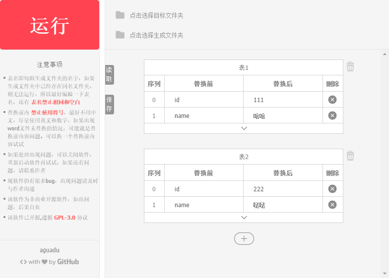

# deal-office
使用electron制作的批量替换.docx和.xlsx内容桌面软件

## 环境

需要全局安装electron和安装electron-packager

## 安装

> 安装依赖

`npm install` //不要用cnpm，不然打包会出错

> 开发环境

`electron .`

> 打包

`run npm-script packager`

## 效果图

